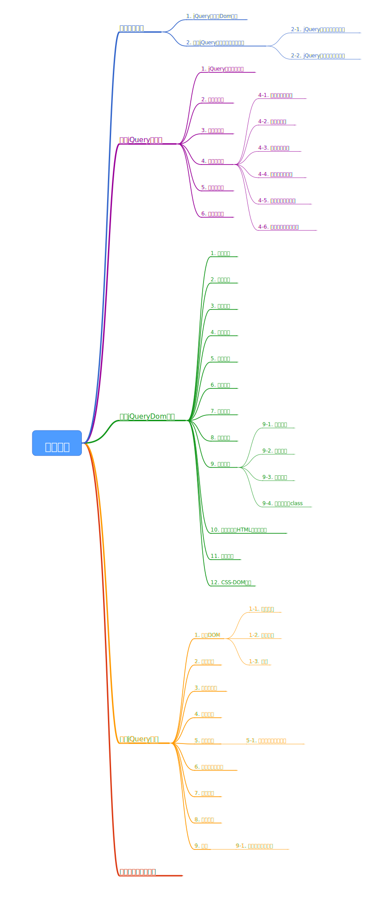

参考来源：《锋利的jQuery》第二版

本文是对jQuery的梳理，阅读起来可能很不顺畅。


PDF版带有思维导图，阅读体验更好

链接：https://pan.baidu.com/s/1-OAtwUFlmbIXZbCkX0C9Rw 
提取码：trv4 


# 简单介绍

 - 支持链式操作
## jQuery对象和Dom对象
如果获取的对象是jQuery对象，那么在变量前面加上$。
``` javascript
var $obj = $("#obj");
```
jQuery提供了两种方法转换为Dom对象，get(index)和[index]。

``` javascript
var $obj = $("#obj"); 	//jQuery对象
var cc = $obj[0];		//cc就是DOM对象，get(0)方法也可以获取
```

对于一个DOM对象，只需要用$把DOM对象包起来即可。
```javascript
var obj = document.getElementById("obj");   	//DOM对象
var cc = $(cc);		//jQuery对象
```


那么，对象从哪来？为什么`$("#id")`就表示一个对象哪？下文代码还有`jQuery()`这种形式，有什么区别？


## 解决jQuery与其他库冲突的问题

### jQuery在其他库之后导入
   1. 可以使用jQuery.noConflict()把￥控制权交给其他js库，使用jQuery()作为jQuery对象的制造工厂
```javascript
    //⋯省略其他代码
    <p id="pp">Test-prototype(将被隐藏)</p>
    <p >Test-jQuery(将被绑定单击事件)</p>
    <!-- 引入 prototype  -->
    <script src="lib/prototype.js" type="text/javascript"></script>
    <!-- 引入 jQuery  -->
    <script src="../../scripts/jquery.js" type="text/javascript"></script>
    <script language="javascript">
        jQuery.noConflict()；//将变量$的控制权移交给prototype.js
        jQuery(function(){//使用jQuery
          jQuery("p").click(function(){
              alert( jQuery(this).text() )；
          })
        })
        $("pp").style.display = 'none'； //使用prototype.js隐藏元素
    </script>
    </body>
    //⋯省略其他代码
```
2. 可以自定义快捷方式
```javascript
	var $j = jqQuery.noconflict()；
```
3. 在jQuery函数内部继续使用$
  ```javascript
      //⋯省略其他代码
    jQuery.noConflict()；       //将变量$的控制权让渡给prototype.js
    jQuery(function($){         //使用jQuery设定页面加载时执行的函数
        $("p").click(function(){   //在函数内部继续使用$()方法
            alert($(this).text() )；
        })
    })
    $("pp").style.display = 'none'；   //使用prototype
    //⋯省略其他代码
  ```
  4. 定义匿名函数
   ```javascript
	jQuery.noConflict();
	(function($){
		$(function(){
			
		});
	});
   ```
### jQuery在其他库之前调用
```javascript
	jQuery(function(){
		
	})
```
# jQuery选择器
## jQuery选择器的优势
1. 当使用原生js选择器时，如果一个元素不存在，会报错，而jQuery不会报错。
 2. jQuery获取的永远是对象，即使它不存在，所有在判断对象是否存在时，需要使用$("#id").length>0来判断，或者转化为DOM对象之后再判断
## 基本选择器
1. $(“#id”)  选择id为id的元素
2. $(".class')  选择class为class的元素
3. $("p")   选择所有p元素
4. $("*")   选择所有元素
5. $("div,span,p.new")  表示选择所有div，所有span，所有class="new"的p标签
## 层次选择器
1. $("div span")  选择div所有span后代
2. $("div > span")    选择div下的span子元素
3. $(".class + div")    选择class=“class”的下一个div元素（同辈关系）<br> **==等同于$(".class").next("div") ==**
4. $("#id~div")    选择id="id"元素之后的所有div（同辈）<br> **==等同于$("#id").nextAll("div") ==**<br>而siblings()方法可以选择所有同辈元素，不在乎前后关系
## 过滤选择器
### 基本过滤选择器
- :first    $("div:first") 选择所有div元素的第一个元素
- :last    $("#div:last")  选择所有div元素的最后一个元素
- :not(select)  $("input:not(.one)")   选择所有class 不是one的input元素
- :even    $("input:even")  选择索引是偶数的input元素
- :odd    $("input:even")    选择索引是基数的input元素
- :eq(index)    索引等于，从0开始
- :gt(index)    索引大于
- :lt(index)    索引小于
- :header    所有的标题
- :focus    所有当前获得焦点的元素
 ### 内容过滤器
 - $("div:contains("我")")  div文本中含有“我”
 - $("div:empty")  空div，文本都木得
 - $("div:parent")  有子元素的div
 - $("div.has(p)")   有p子元素的div
  ### 可见性过滤器	
 - $("div:hidden")<br>包括display为none的元素，还包括type="hidden"、visibility:hidden的元素
 - $("div:visible")
 ### 属性过滤选择器
 - $("div[id]")  有id属性
 - $("div[title=test]")     属性title的值为test
 - $("div[title!=test]")    属性title不为test
 - $("div[title^=test]")    属性title的值以test开头
 - $("div[title$test]")    属性title的值以test结尾
 - $("div[title*test])     属性title的值中含有test
 ### 子元素过滤选择器
  :nth-child()选择器是很常用的子元素过滤选择器，详细功能如下。
 - :nth-child(even)能选取每个父元素下的索引值是偶数的元素。
 - :nth-child(odd)能选取每个父元素下的索引值是奇数的元素。
 - :nth-child(2)能选取每个父元素下的索引值等于2的元素。
 - :nth-child(3n)能选取每个父元素下的索引值是3的倍数的元素，（n从1开始）。
 - :nth-child(3n+1)能选取每个父元素下的索引值是（3n+1）的元素。（n从1开始）
 ### 表单对象过滤选择器
 - :enabled
- :disabled
- :checked   单选框，复选框
- :selected   下拉
## 表单选择器
$(":input")  包括input、button、select、textarea<br>
其他的形如：$(":text")，其他如：password、radio、checkbox、submit、img、reset、file
## 选择器注意
如果带有特殊符号，需要使用\来转义
# jQueryDom操作
## 查找结点
```javascript
$("ul li:eq(1)	").text();   //查找结点并打印内容
$("p").attr("title")    //p元素的title属性值
```
## 创建结点

通过jQuery的工厂函数$()
```javascript
$("ul").append($("<li></li>"))    //创建li并添加到ul中
```
## 插入结点
- append()    $(a).append(b)   b插入到a    
- appendTo()  反过来插入   $(a).appendTo(b)  a插入到b
- prepend()   插入到前边
- prependTo()   反过来插入
- after()   在元素之后插入
- insertAfter()   反过来
- before()   在元素之后插入
- insertBefore()   反过来
  不仅仅可以新增，也可以对原有的元素进行操作，改变原有顺序。如果对原有元素进行操作，是先删除再添加 结合remove方法思考
## 删除结点
- remove()   
  
  $("div[id=one]").remove()   该结点删除后，其子元素都会被删除，并且返回值是这个被删除元素的引用，因此可以用变量接受后再次使用<br>
  也可以传参选择性删除
  
- empty()    清空所有子元素
 ## 复制结点
 - clone()   `$("div[id=name]").clone().appendTo("p")`
    可以带参数：clone(true)  表示把事件绑定也复制过去
## 替换结点
- replaceWith()   $(a).replaceWith(b)  把a替换为b
- replaceAll()  $(a).replaceAll(b)  把b替换为a
 注意：如果替换前绑定了事件，替换后需要重新绑定事件
 ## 包裹结点
 - wrap()  
   ```javascript
   ("strong").wrap("<b></b>")  
   ```
   结果是： 
    ```javascript
	<b><strong></strong></b>
	<b><strong></strong></b>
	
	 ```

 - wrapAll()方法
   结果是：
   
   ```javascript
   <b>
   <strong></strong>
   <strong></strong>
   </b>
   ```
   如果中间还有其他元素，会把其他元素放置到后边
 - wrapInner()方法 
   该方法将每一个匹配的元素的子内容（包括文本节点）用其他结构化的标记包裹起来。例如
   ```javascript
   $("strong").wrapInner("<b></b>")
   ```
   可以使用它来包裹\<strong\>标签的子内容，代码如下:
   ```javascript
   <strong title="选择你最喜欢的水果." ><b>你最喜欢的水果是？</b></strong>
   ```
 ## 属性操作
 - attr()方法来获取和设置元素属性，removeAttr()方法来删除元素属性
   获取属性值，传一个参数，设置属性值，传两个参数，如果需要设置多个参数可以使用下面这种格式
   ```javascript
   //将一个“名/值”形式的对象设置为匹配元素的属性
   $("p").attr({"title" : "your title" , "name": "test" })；  
   ```
    外还有html()、text()、height()、width()、val()和css()等方法。
	jQuery1.6中新增了prop()和removeProp()，区别在于这两个方法只获取匹配元素的第一个。
  ## 样式操作
  ### 增加样式
 - 可以使用attr设置
 - 也可以使用addClass追加
   如果此时，追加的css属性与原有重复，则使用追加的属性
 ### 删除样式
 - 使用removeClass删除属性
   如果需要删除多个属性，可以使用链式调用，使用多个removeClass，或者使空格：removeClass("one two")
   此外如果不带参数，会删除全部class
### 切换样式
- 使用toggle()交替一组动作，比如下面这个案例，如果当前是显示的，就隐藏，如果当前是隐藏的，就显示
 ```javascript
$toggleBtn.toggle(function(){       //toggle()，交替一组动作
    //显示元素    代码③
},function(){
    //隐藏元素    代码④
})
 ```
 - 使用toggleClass()
   比如`toggleClass("abother")`  &nbsp;&nbsp;如果当前有another的class就删除，如果没有就增加
 ### 判断是否有class
 - hasClass()
   这个方法是为了增强代码可读性而产生的。在jQuery内部实际上是调用了is()方法来完成这个功能的。该方法等价于如下代码：$("p").is(".another")；

## 设置和获取HTML、文本和值

1. html()    =    js中的innerHTML

2. text()     =     js中的innerText 

3. val()      =      js中的value属性

   除此之外，val()还能使select（下拉列表框）、checkbox（多选框）和radio（单选框）相应的选项被选中，在表单操作中会经常用到。

   如果只选择一个，传一个参数，如果选中多个，传递一个数组

## 遍历结点

1. children() 子元素的集合

2. next()        紧邻的同辈元素

3. prev()        前面紧邻的同辈元素

4. siblings()   匹配前后所有同辈元素

5. closest()    该方法用于取得最近的匹配元素。首先检查当前元素是否匹配，如果匹配则直接返回元素本身。如果不匹配则向上查找父元素，逐级向上直到找到匹配选择器的元素。如果什么都没找到则返回一个空的jQuery对象。

   parent()   parents()  closest()  三者的区别

   | parent       | parents        | closest                          |
   | ------------ | -------------- | -------------------------------- |
   | 在父结点查找 | 在祖先结点查找 | 先在同级找，同级找不到在去祖先找 |

6. ==还有find()、filter()、nextAll()和prevAll()等元素，待补充==

## CSS-DOM操作

1. css()

```javascript
$(“#id”).css("color");	//获取color属性值
$("#id").css("color","#aaa");	//设置color值
$("#id").css({"color":"#aaa","background-color":"#fff"});	//设置多个样式
```

 2. height()/width()

    获取/设置元素的高度，也可以使用css()。

    css()方法获取的高度值与样式的设置有关，可能会得到"auto"，也可能得到"10px"之类的字符串；而 height()方法获取的高度值则是元素在页面中的实际高度，与样式的设置无关，并且==不带单位==。

	3. offset()

    获取当前元素在当前视窗的相对便宜，返回的对象包含两个属性 top和left，并且==只对可见元素有效==。

	4. position()

    获取元素相对于最近的一个**position样式属性设置为relative或者absolute的祖父节点**的相对偏移，它返回的对象也包括两个属性， top和left

	5. scrollTop()方法和scrollLeft()方法

    这两个方法的作用分别是获取元素的滚动条距顶端的距离和距左侧的距离。

    另外，可以为这两个方法指定一个参数，控制元素的滚动条滚动到指定位置

# jQuery事件

## 加载DOM

### 执行时机

jQuery使用$(document).ready()为元素添加事件

$(document).ready()和document.onload()的区别

| document.onload()      | $(document).ready()                                          |
| ---------------------- | ------------------------------------------------------------ |
| 所有元素加载完毕后执行 | DOM树加载完毕即执行，但此时可能某些元素还未加载，无法对其操作，所以jQuery提供了load()方法。 |

如果处理函数load()绑定给window对象，则会在所有内容（包括窗口、框架、对象和图像等）加载完毕后触发，如果处理函数绑定在元素上，则会在元素的内容加载完毕后触发。

```javascript
$(window).load(function(){
    
});
```

### 多次使用

在之前写js的时候，经常这么写：

```javascript
window.onload=function(){
    function1();
    function2();
}
```

用来在网页加载完毕后执行这两个方法。这么写没啥大问题，但是遇到多个js文件都要使用window.onload()时就很麻烦。

因为onload事件一次只能保存一个对一个函数的引用，如果写两个， 会自动用后面的覆盖掉前面的。

而jQuery就不会，jQuery会在先有的行为上追加，按照注册的顺序执行，所以完全可以这么写：

```javascript
$(document).ready(function(){
    function1();
})

$(document).ready(function2(){
	function2();                  
})
```

### 简写

```javascript
$(function(){

});
```

或者

```javascript
$().ready(function(){   //$()不带参数，表示document
    
})
```

## 事件绑定

调用格式：`bind(type[,data],fn)`

第一个参数是事件类型：blur、focus、load、resize、scroll、unload、click、dblclick、mousedown、mouseup、mousemove、mouseover、mouseout、mouseenter、mouseleave、change、select、submit、keydown、keypress、keyup和error等，也可以是自定义。

第二个参数可选，最为event.data的属性值传递给事件的额外数据对象。

第三个参数是用来绑定的函数。

比如：

```javascript
$(function(){
    $("#id").bind("click",function(){
        alert("666");
    })
})
```

比较骚气的是，可别忘了这玩意可以链式调用:

```javascript
$(function(){
    $("#id").bind("click",function(){
        
    }).bind("mouseout",function(){
        
    })
})
```

当然还可以这样:

```javascript
$(function(){
    $("#id").bind("mouserover mouseout",function(){
        
    })
})
```


## 方法的简写

当然，如果事件多了，都这么写还是有点麻烦的，所以jQuery对这些常用的click、mouseout等事件提供了简写方式:

```javascript
$("#id").click(function(){
    
})
```

## 合成事件

1. hover() 语法格式：`hover(enter,leave)`       触发 mouseenter 和 mouseleave 事件，如果只传一个参数，两个都执行。

2. toggle() 语法格式：`toggle(fn1,fn2.....fnn)`     用于模拟鼠标连续点击事件，当点击第一次，执行fn1，往后==顺序轮番==执行

   toggle()方法在jQuery中还有另外一个作用：切换元素的可见状态

## 事件冒泡

比如：

```javascript
<body>
    <div>
    	<span></span>
    </div>
</body>
```

这三层都分别绑定了事件，单击span时不仅触发了span的事件，其他两层的事件也会触发。

事件会按照DOM层次不断向上直至顶端，这就是事件冒泡。

### 事件冒泡带来的问题

问题显而易见。

为了解决这个问题，jQuery提供了一些方法。

先铺垫下，jQuery中存在事件对象的概念：

```javascript
$("#id").bind("click",function(event){			//这个event就是事件对象
    
})
```

停止事件冒泡：

```javascript
$("#id").binf("click",function(event){
    //其他逻辑
    event.stopPropagation();
})
```

阻止默认行为：preventDefault()；

比如超链接，点击就会跳转。

当然还有一个终极大法：`return false;`  

==jQuery不支持事件捕获。==

## 事件对象的属性

1. `event.type`

2. 上面提到的两个方法

3. `event.target`获取触发事件的元素

   ```javascript
   $("a[href='http://www.baidu.com']").click(function(event){
       vat tg = event.target;		//获取事件对象
       alert(tg.href);
       return false;		//阻止默认跳转行为
   })
   ```

4. `event.relatedTarget` 

   返回与事件的目标节点相关的节点。

   对于 mouseover 事件来说，该属性是鼠标指针移到目标节点上时所离开的那个节点。

   对于 mouseout 事件来说，该属性是离开目标时，鼠标指针进入的节点。

   ==对于其他类型的事件来说，这个属性没有用。==

5. `event.pageX和event.pageY`

   该方法的作用是获取到光标相对于页面的x坐标和y坐标。如果页面上有滚动条，则还要加上滚动条的宽度或高度。

   ```javascript
   $("a").mousedown(function(event){
       alert(event.which);
   })   
   
   $("a").keyup(function(e){
       alert(e.which);
   })  
   ```

   ==更多事件待补充==  可能不补充了，太多了，看https://api.jquery.com/category/events/

## 移除事件

1. `unbind([type],[data])`  第二个参数存在的意义，可以移除特定的事件
2. `one()`执行一次即解除，格式与bind相同

## 模拟操作

比如：`$("#id").click();`模拟点击操作，也可以用`trigger("click")`，此外，trigger还可以触发自定义事件

`trigger(type[,data])`用来传递数据

```javascript
$("#bt").bind("myfun",function(event,m1,m2){
    alert("数据："+m1+m2);
});
$("#bt").trigger("myfun",["数据1","数据2"]);
```

`triggerHandler()` 

触发被选元素的指定事件类型。但不会执行浏览器默认动作，也不会产生事件冒泡。

triggerHandler() 方法与 trigger() 方法类似。不同的是它不会触发事件（比如表单提交）的默认行为，而且只影响第一个匹配元素。

## 其他

### 添加事件命名空间

```javascript
$("#id").bind("click.spacename",function(){
    
})
//当移除的时候可以
$("#btn").click(function(){
    $("#id").unbind(".spacename");
})
```


因为参考的是《锋利的jQuery》，

版本交老，现在都3.5.1了！

==后续增删改==

# 后面的就不写了


